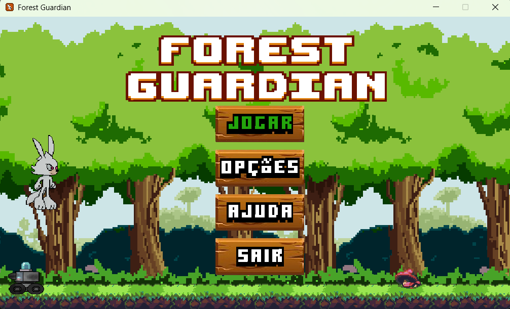
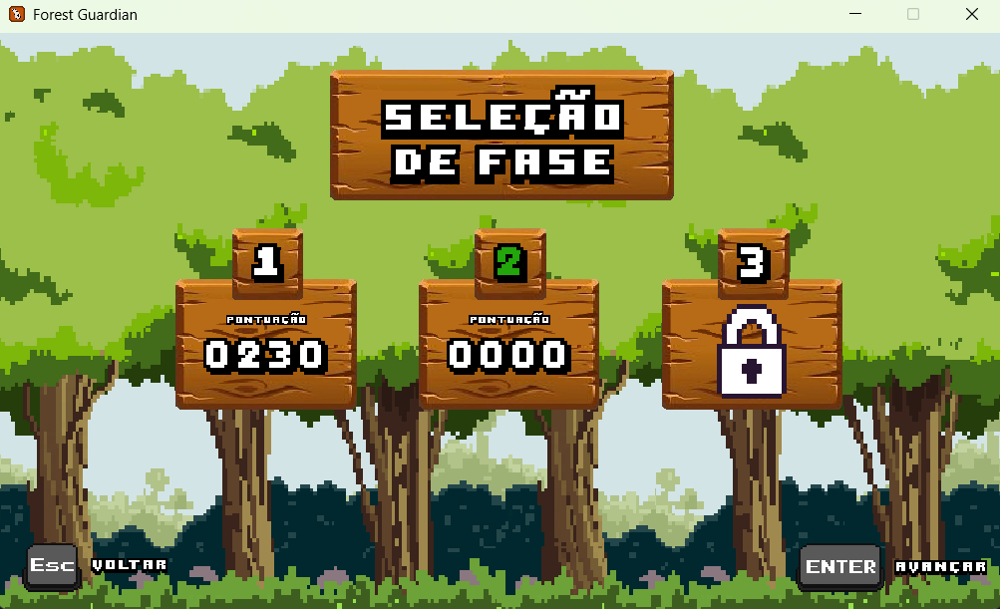
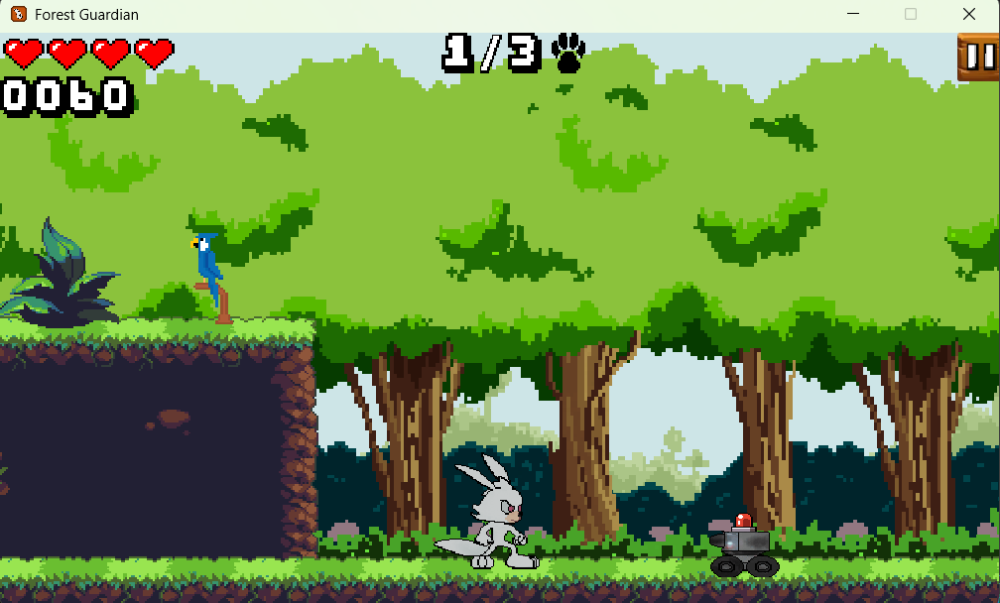
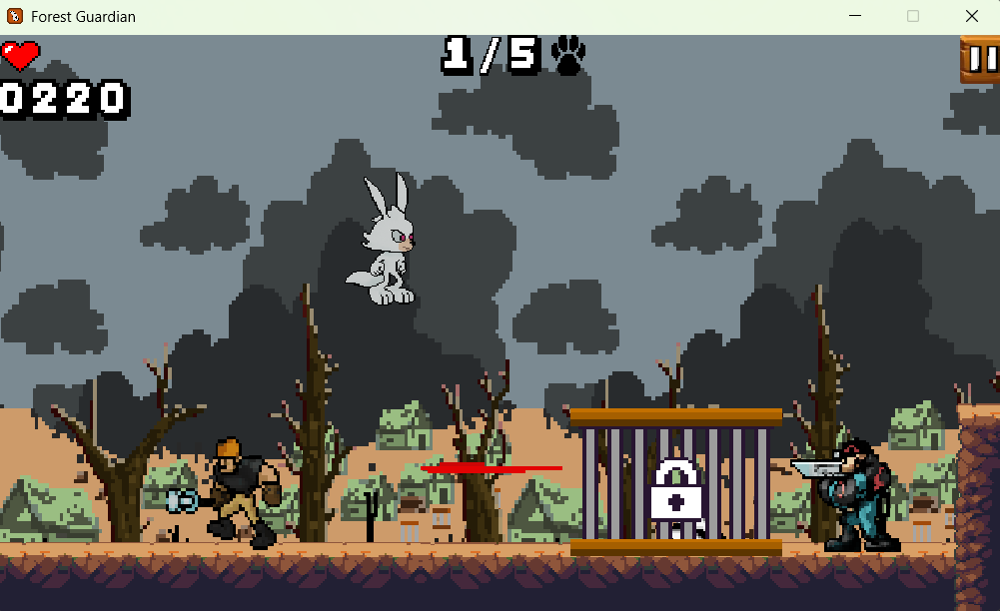
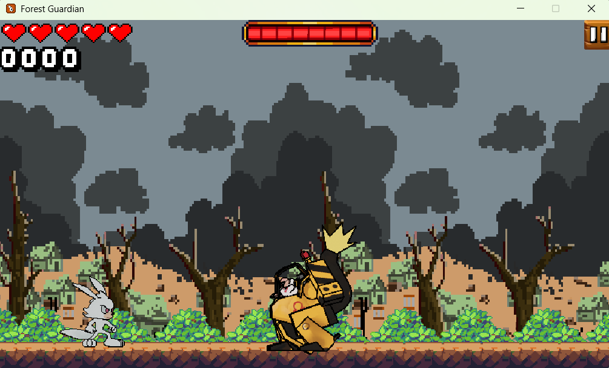

# Forest Guardian

Forest Guardian é um jogo de aventura e plataforma 2D desenvolvido em Java. O jogador controla Snow, um coelho exótico, em uma missão para resgatar sua mãe adotiva, a coruja Luna, e outros animais da floresta das garras do Dr. Ômega e sua organização de contrabandistas.

## Sobre o Jogo

O projeto é um jogo de plataforma side-scrolling dividido em três fases, cada uma com seus próprios desafios, inimigos e animais para resgatar.

### História

A trama segue Snow, um coelho exótico que vive em uma floresta mística com sua mãe adotiva, Luna, uma coruja. A paz da floresta é interrompida quando a organização "Ômegas", um grupo de contrabandistas liderados pelo Dr. Ômega, invade para capturar os animais.

Snow retorna para casa e descobre que Luna foi levada. Sua missão é invadir a base dos Ômegas, dividida em três fases, para resgatar sua mãe e todos os outros animais aprisionados.

### Gameplay

* **Plataforma 2D:** O jogo utiliza uma câmera de rolagem lateral (side-scrolling) com um efeito parallax para criar profundidade no cenário.
* **Controles:** O jogador controla o Snow, que pode correr, pular e usar um ataque giratório ("rodopiar") para derrotar inimigos e quebrar jaulas.
* **Objetivos:** O objetivo principal é navegar pelos níveis, derrotar inimigos, resgatar todos os outros animais presos em jaulas e, finalmente, derrotar o chefe.
* **Inimigos:** A base é protegida por vários inimigos:
    * **Shock Troopers:** Guardas que atacam com bastões elétricos.
    * **Mega Karts:** Veículos robóticos que patrulham a área.
    * **Ômega Troopers:** Soldados de elite que disparam projéteis.
* **Chefe Final:** A terceira fase culmina em uma batalha contra o **Dr. Ômega**, que pilota um mecha de combate com ataques de *dash* e projéteis.
* **Coletáveis e HUD:** O jogador tem um número limitado de vidas (representadas por corações). É possível coletar cerejas para recuperar a vida. O HUD (Interface do Usuário) exibe as vidas, a pontuação e a contagem de animais resgatados.

## Tecnologias Utilizadas

* **Linguagem Principal:** **Java**
* **Interface Gráfica e Renderização:** **Java Swing** (para a janela principal `JFrame` e painéis `JPanel`) e **Java AWT** (para renderização de gráficos `java.awt.Graphics` e gerenciamento de eventos).
* **Áudio:** A biblioteca **Jaco MP3 Player** (`jaco-mp3-player-0.9.3.jar`) é utilizada para carregar e reproduzir todos os efeitos sonoros e a música de fundo do jogo.
* **Build:** O projeto está configurado para ser compilado e empacotado usando **Apache Ant** (via `build.xml`).

## Como Executar o Projeto

### 1. Via VS Code (Recomendado)

1.  Clone este repositório para a sua máquina local.
2.  Certifique-se de ter o **Extension Pack for Java** da Microsoft instalado no seu VS Code.
3.  Abra a pasta do projeto clonado no VS Code (`Arquivo > Abrir Pasta...`).
4.  O VS Code deve detectar automaticamente o projeto Java, incluindo a biblioteca `.jar` no classpath.
5.  Navegue até o arquivo `src/forestguardian/ForestGuardian.java`.
6.  Clique no botão "Executar" (Run) que aparece acima do método `public static void main(String[] args)`.
7.  Alternativamente, use a visualização "Executar e Depurar" (Run and Debug) no painel lateral.

### 2. Via IDE (Apache NetBeans)

1.  Clone este repositório.
2.  Abra o projeto no Apache NetBeans IDE (o projeto contém os arquivos de configuração `nbproject/`).
3.  A IDE deve detectar automaticamente a classe principal (`forestguardian.ForestGuardian`) e o classpath.
4.  Execute (Run) o projeto (pressionando F6, por padrão).

### 3. Via Linha de Comando (Usando Apache Ant)

Se você tiver o Apache Ant instalado e configurado em seu PATH, você pode compilar e executar o projeto pela linha de comando.

1.  Clone o repositório:
2.  Navegue até o diretório raiz do projeto (onde o arquivo `build.xml` está localizado).
3.  Compile e crie o arquivo `.jar` executável:
    ```bash
    ant jar
    ```
4.  Execute o arquivo `.jar` gerado, que estará no diretório `dist/`:
    ```bash
    java -jar dist/ForestGuardian.jar
    ```

## 🖼️ Capturas de Tela

| Menu Principal | Seleção de Fase |
| :---: | :---: |
|  |  |

| Fase 1 | Fase 2 |
| :---: | :---: |
|  |  |

| Batalha contra o Chefe (Fase 3) |
| :---: |
|  |

## 👥 Equipe

Este projeto foi desenvolvido por Ayumi, Francisco e Gideão durante o 2º ano do ensino médio técnico em informática no IFAM em 2019.
